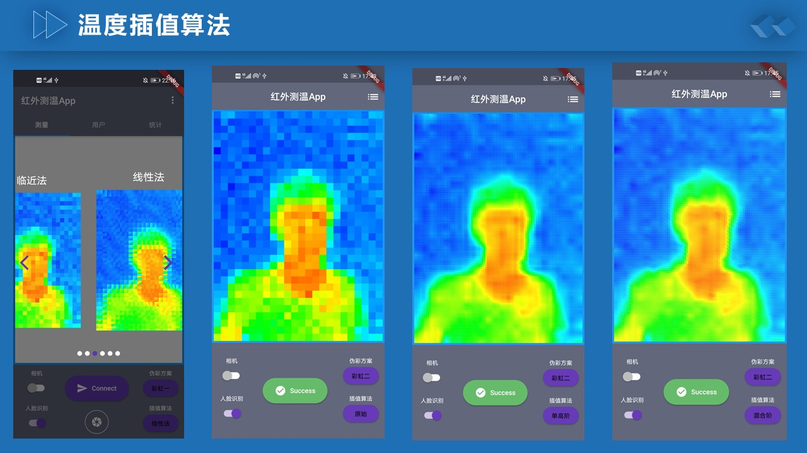
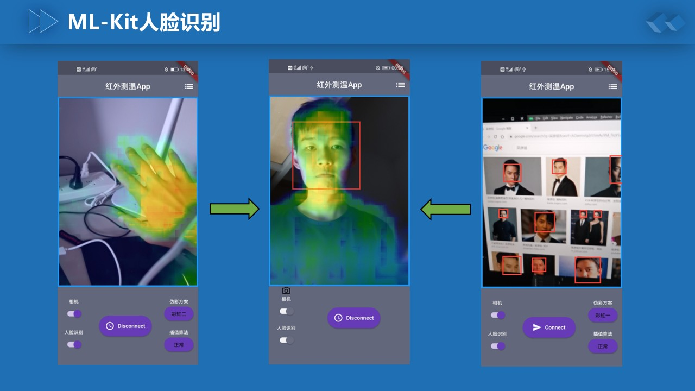
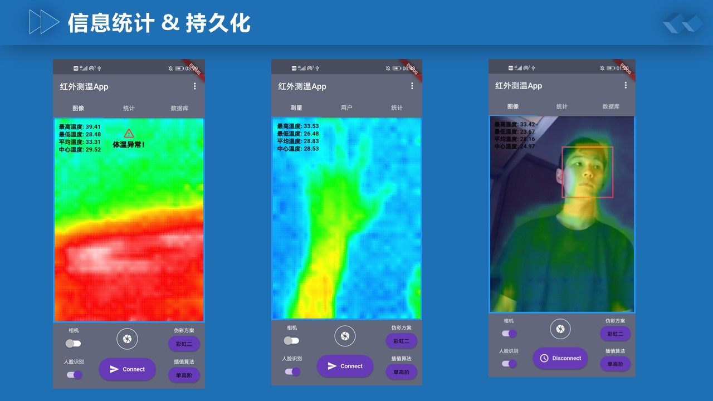
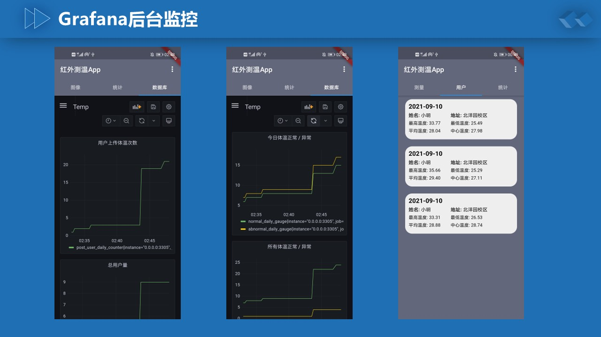

# TempApp 体温监测系统

1. 本应用收集来自**Arduino ESP32红外传感器**的数据，并实现了多种**矩阵插值**和**伪彩色编码**算法用于生成红外图像

2. 本应用使用**Google ML Kit**对系统相机进行**人脸识别**，并将红外图像和相机图像叠加后统一展示，用户可以通过"拍照"记录当前温度数据并上传至mysql后端

3. 后端使用**Gorm + Gin**实现，并通过**Prometheus + Grafana**进行**数据监控和可视化**，可以在app的webview中查看

   > 后端仓库在[这里](https://github.com/cjdjczym/TempBackend)

***

